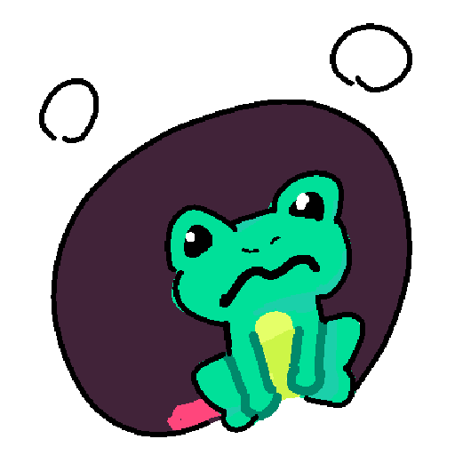

  
  

# what the hell is this
im a procrastination master and i keep doomscrolling on twitter and youtube for like hours \
so i speedran this extension to stop that

name stems from the phrase "eat the frog" which i like to interpret as finish that one task you keep procrastinating. like it Isnt that hard bro just get off twitter do the god damn task already